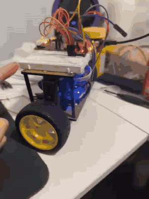
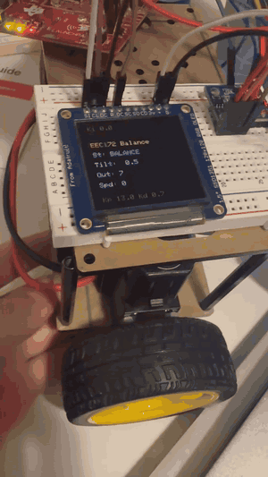
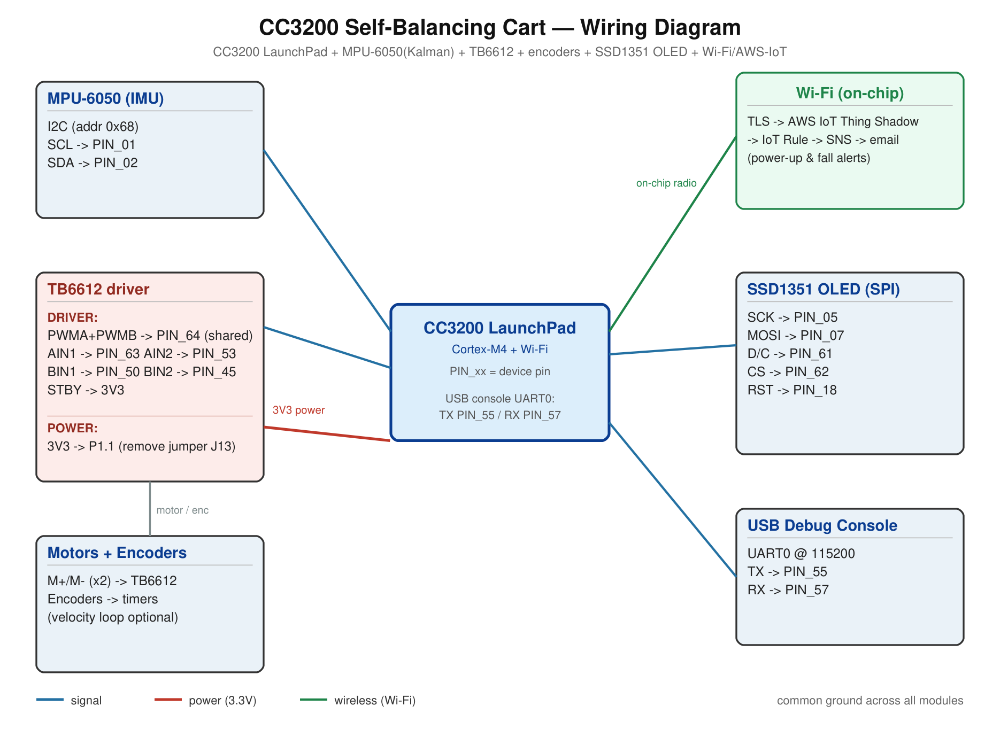

# Self-Balancing Cart — CC3200 Firmware

Self-balancing two-wheel robot on a **TI CC3200 LaunchPad** (Cortex-M4 + on-chip Wi-Fi). Keeps itself upright with a cascaded PID controller fed by a **Kalman-filtered IMU**, shows live telemetry on a colour OLED, and **emails an alert over Wi-Fi** (AWS IoT) when it powers on or falls over.

| | |
|---|---|
| **MCU** | TI CC3200 (CC3200-LAUNCHXL, Cortex-M4 + Wi-Fi) |
| **Toolchain** | Code Composer Studio 9.3+ · TI Arm compiler `armcl` 20.2.7 · UniFlash |
| **Build** | Bare-metal (SimpleLink SDK 1.5.0) |
| **Status** | ✅ Working |

---

## Demo

| Self-balancing | OLED telemetry |
|:---:|:---:|
|  |  |

---

## Features

- **Self-balancing** — inner **angle PD** (tilt + gyro) summed with an optional **velocity PI** (encoders) and **yaw-rate turn** loop into one motor command; angle loop at **200 Hz**.
- **Sensor fusion** — MPU-6050 accel + gyro fused by a **2-state Kalman filter** (angle + gyro-bias) for a smooth, drift-free tilt estimate.
- **Motor drive** — TB6612FNG dual H-bridge at ~19.6 kHz PWM (inaudible).
- **Colour telemetry** — SSD1351 128×128 OLED (SPI) shows state, tilt, motor output, and live PID gains.
- **Live serial tuning** — adjust every PID gain over the UART0 console at runtime; no recompile.
- **Wi-Fi email alerts** *(optional)* — at boot and on a fall, posts to an **AWS IoT Thing Shadow over TLS**; an IoT rule forwards to **SNS**, which emails you.

> Ultrasonic ranging, buzzer, and HC-05 remote are scaffolded but disabled in this build. Encoders + the velocity loop are present and enabled in [`src/hw_config.h`](src/hw_config.h).

---

## Wiring

## Hardware

| Part | Notes |
|------|-------|
| CC3200-LAUNCHXL | Cortex-M4 + on-chip Wi-Fi |
| MPU-6050 (GY-521) | 6-axis IMU over I²C (`0x68`) |
| TB6612FNG | dual H-bridge, 5.5–15 V motor supply |
| 2 × encoder gear-motors | TARKBOT MC130, 1:48 gear, Ø66 mm wheels |
| SSD1351 OLED | 128×128 colour, 4-wire SPI |
| TARKBOT R3T chassis | 167 mm wheelbase |

**Power:** feed the TB6612's 3.3 V output into **P1.1** and remove jumper **J13** (isolates the on-board LDO), per TI User's Guide SWRU372 §2.5.3. Do **not** feed 5 V into P3.1 — it's a USB-VBUS *output*, not a supply input. Tie all grounds together. Full pin table is in [`src/hw_config.h`](src/hw_config.h) (the single source of truth).

> **PWM-pin constraint:** the CC3200 has very few free hardware-PWM pins, so the default build shares one PWM line (`PIN_64`) across both wheels (`MOTOR_SHARED_PWM 1`) — enough for balancing. Independent per-wheel PWM (for differential steering) needs a second timer pin; see `hw_config.h`.

---

## Build & flash

1. *File → Import → C/C++ → CCS Projects*, search-dir = this `CC3200` folder, tick **BalanceCart_CC3200**, **uncheck** "copy into workspace", Finish. *(Import the bundled `.project`, not the `.projectspec`.)*
2. Set path variable `CC3200_SDK_ROOT` to your CC3200 SDK's `cc3200-sdk` folder (*Properties → Resource → Linked Resources → Path Variables*).
3. **Build** → produces `BalanceCart_CC3200.bin`.
4. Flash the `.bin` as the boot image (`/sys/mcuimg.bin`) with **UniFlash**, then power-cycle.

The CC3200 SDK 1.5.0 is a third-party dependency and is not committed here.

---

## Configuration ([`src/hw_config.h`](src/hw_config.h))

| Flag | Default | Purpose |
|------|---------|---------|
| `ENABLE_OLED` | `1` | SSD1351 SPI display |
| `MOTOR_SHARED_PWM` | `1` | one PWM pin drives both wheels |
| `ACCEL_SOURCE_IS_BMA222` | `0` | `0` = MPU-6050 accel, `1` = on-board BMA222 |
| `ENABLE_WIFI_EMAIL` | `1` | startup / fall email via AWS IoT |
| `USE_VELOCITY_LOOP` / `USE_TURN_LOOP` | `0` | encoder velocity PI / yaw turn loop |
| `BALANCE_KP / KI / KD` | `13 / 0 / 0.7` | angle-loop gains (±255 PWM scale) |

**Wi-Fi email** also needs the SimpleLink build settings (include paths, `simplelink.a`, no `NON_NETWORK`), a 2.4 GHz network (SSID in the SDK `common.h`), the AWS root-CA/client/private-key certs flashed to `/cert/`, and a roughly-correct date for TLS. Set `ENABLE_WIFI_EMAIL = 0` for a lean, network-free build.

---

## Bring-up

1. **Wheels off the ground**, motors confirmed at zero command.
2. **Check IMU axes** (`DEBUG_IMU_RAW 1`): tip forward → tilt rises `+`; else adjust the `MPU_*_AXIS / *_SIGN` macros.
3. **Check motor direction:** a forward lean must drive *both* wheels forward; else flip `MOTOR_L_INVERT` / `MOTOR_R_INVERT`.
4. **Tune** `Kp` then `Kd` over serial until it stands.

---

*Sibling build: the [STM32 version](../STM32/README.md) runs the same control law with Bluetooth remote, ultrasonic avoidance, live tuning, and flash-persisted config.*
