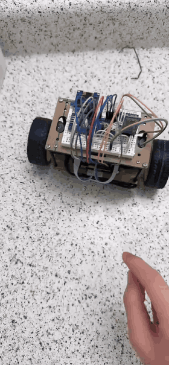
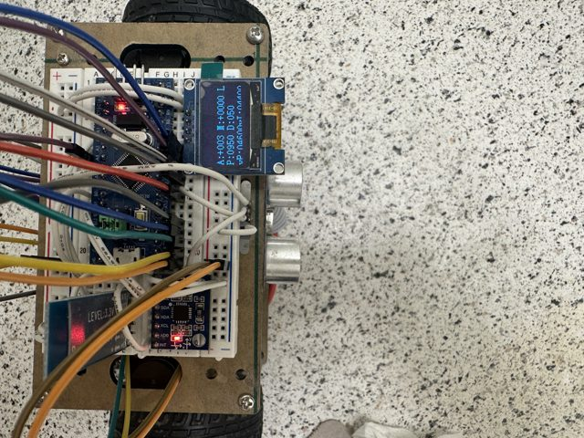
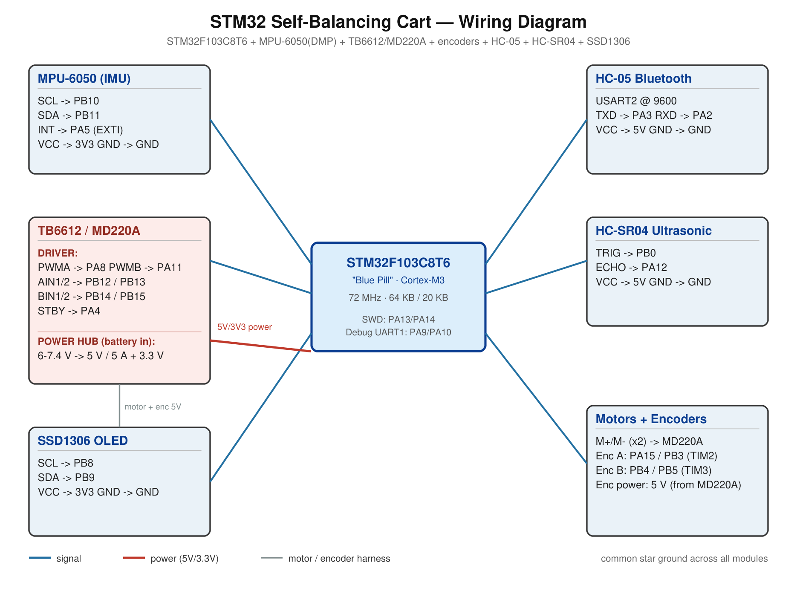

# Self-Balancing Cart — STM32 Firmware

Self-balancing two-wheel robot on a generic **STM32F103C8T6 "Blue Pill"** with hand-wired discrete modules (MPU-6050 IMU, TB6612 motor/power board, dual encoders, HC-05 Bluetooth, HC-SR04 ultrasonic, SSD1306 OLED). The balance loop runs in the **MPU-6050 data-ready interrupt at 100 Hz** using the on-chip **DMP**, so the cart stays upright independent of the RTOS scheduler.

| | |
|---|---|
| **MCU** | STM32F103C8T6 (Cortex-M3, 72 MHz, 64 KB flash / 20 KB RAM) |
| **Toolchain** | Keil MDK µVision 5 · Arm Compiler 5 (V5.06) |
| **Library / RTOS** | STM32F10x StdPeriph + FreeRTOS V9 (heap_4, 8 KB heap) |
| **Status** | ✅ Running on hardware — balancing, remote drive, live tuning & flash config verified; ultrasonic avoidance in bring-up |

---

## Demo

| Self-balancing + Bluetooth remote | OLED telemetry |
|:---:|:---:|
|  |  |

---

## Features

- **Cascaded balance control** — inner **angle PD** (tilt + gyro) + outer **velocity PI** (encoders) + **heading PD** (yaw rate), summed into the motor command at **100 Hz** inside `EXTI9_5_IRQHandler` (`Robot/ax_balance.c`). Tuned and working: `Kp 950 / Kd 50`, `vKp 4600 / vKi 4400`.
- **Motor dead-zone compensation** — adds the wheels' minimum-turn PWM to every non-zero command so small corrections actually move the cart, eliminating the static-friction **limit-cycle wobble** that no Kp/Kd value can remove.
- **Live PID tuning over Bluetooth** — select a gain (`1`–`5`) and step it with `+`/`-`; flip the velocity sign live (`Y`); watch a 6-channel serial plot stream. No recompile.
- **Flash-persisted config** — `W` saves all tuned values (gains, dead-zone, midpoint, sign) to internal flash with a **read-back verify** (OLED shows `S`/`X`/`L`); reloaded at boot. `Z` erases.
- **Bluetooth remote** — HC-05 SPP, single-character commands; drive `F/B/L/R/S` only set `vx`/`vw` targets while the balance loop keeps the cart upright.
- **Ultrasonic obstacle avoidance** — always-on `<20 cm` forward stop, plus an opt-in (`O`) **scan-and-turn state machine** (`Robot/ax_avoid.c`): on a close obstacle the cart brakes, rotates in place to sweep its fixed sensor across headings, turns toward the clearest one, and resumes — all while balancing.
- **Self-recovery & safety** — fall protection cuts the motors past ±45°; `Balance_PutDown()` re-arms when set upright and nudged; integral anti-windup, per-loop output clamps, and an int32 PWM mix prevent runaway/overflow.
- **OLED telemetry** — SSD1306, two views (`D` toggles): **RUN** (avoidance state / distance / drive targets / angle) and **TUNE** (live gains).

---

## Bluetooth command set

HC-05 on **USART2 @ 9600** (transparent SPP). Send single characters from any BT serial app (*Serial Bluetooth Terminal* on Android works well — map each letter to a macro button). Parsed in `Robot/ax_control.c`.

| Group | Keys |
|-------|------|
| **Drive** | `F` fwd · `B` back · `L`/`R` turn · `S` stop · `O` toggle avoidance |
| **Loops/view** | `V` velocity loop · `T` turn loop · `Y` flip velocity sign · `C` auto-midpoint · `D` OLED RUN/TUNE view |
| **Tune** | `1`–`5` select Kp / Kd / vKp / vKi / dead-zone · `+`/`-` step · `M` capture midpoint |
| **Save** | `W` save all to flash (verified) · `Z` erase saved config |

Full tuning procedure: **[TUNING.md](TUNING.md)**.

---

## Wiring

**Key signals** — summary only; wire from **[WIRING.md](WIRING.md)**, which has the full table, power-rail plan, and 5 V-tolerance cautions:

| Function | Peripheral | STM32 pin(s) |
|----------|-----------|--------------|
| Motor PWM A / B | TIM1_CH1 / CH4 | PA8 / PA11 |
| Motor dir + STBY | GPIO | AIN/BIN PB12–PB15, STBY PA4 |
| Encoders L / R | TIM2 / TIM3 (remap) | PA15·PB3 / PB4·PB5 |
| MPU-6050 | soft-I²C + INT | SCL PB10, SDA PB11, **INT PA5** |
| OLED (SSD1306) | soft-I²C | SCL PB8, SDA PB9 |
| HC-SR04 | GPIO (DWT timing) | TRIG PB0, ECHO PA12 |
| HC-05 | USART2 | PA2 / PA3 |
| Heartbeat LED | GPIO | PC13 |

**Notable**: encoders are remapped onto TIM2/TIM3's **5 V-tolerant** pins (the default PA0/1/6/7 are not), letting the TB6612 board's 5 V Hall signals wire straight to the 3.3 V MCU. JTAG is disabled (SWD kept) to free those pins.

---

## Build & flash

1. Open `Project/xproject.uvprojx` in **Keil µVision 5** (device `STM32F103CB`; install the `Keil.STM32F1xx_DFP` pack if prompted).
2. **Build** (`F7`).
3. Flash over **SWD** (PA13/PA14) — ST-Link or CMSIS-DAP. *(Lower the SWD clock to ~1 MHz if programming fails on long/clone wiring.)*

Build symbols `USE_STDPERIPH_DRIVER, STM32F10X_MD`; startup `startup_stm32f10x_md.s`.

---

## Engineering notes

A few problems worth calling out — each was diagnosed from behaviour + the 6-channel plot, then fixed in firmware:

- **Velocity-loop positive feedback** — a wrong encoder/motor sign made a pushed cart accelerate *into* the push. Added a runtime **sign toggle** (`Y`, persisted) so the braking direction is set empirically in one keypress instead of guess-and-reflash.
- **Dead-zone limit cycle** — a slow wobble that no Kp/Kd could remove; root cause was the motor dead-band. Fixed with **dead-zone compensation** on the final PWM (tunable, default 120).
- **int16 PWM overflow** — at large tilt the `angle + velocity + turn` mix could wrap and spike the motors full-reverse; hardened by computing the mix in **int32** and clamping to the rail.
- **Silent flash-save failures** — added a **read-back verification** after every save, surfaced on the OLED, so a failed write can't masquerade as success.
- **Cold-boot reliability** — the MPU/DMP needs the 3.3 V rail settled first; `main()` adds a power-up delay + `mpu_init()` retry and holds the motors disabled across DMP init.

The firmware is structured as a hardware-paced balance ISR (`ax_balance.c`) plus FreeRTOS supervisor tasks (`ax_task.c`): control/remote, ultrasonic ranging, OLED, and heartbeat. All gains live in `Robot/ax_robot.c`.

---

*Sibling build: the [CC3200 version](../CC3200/README.md) runs the same control law with Wi-Fi / AWS-IoT alerts.*
