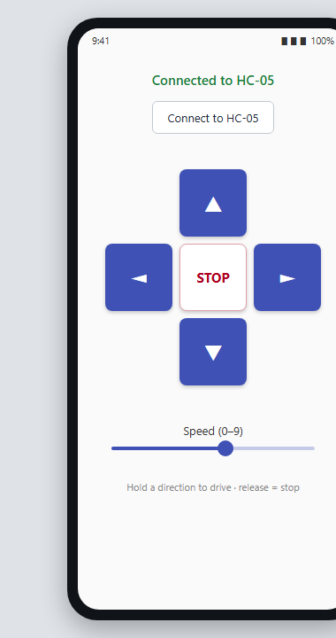

# BalanceBot Remote — Android App

An Android phone app that drives my [self-balancing two-wheel robot](https://github.com/ChenSiyun1234/BalanceBot-STM32-CC3200)
over its **HC-05 Bluetooth** module using the classic-Bluetooth **Serial Port Profile (SPP)**.
It's the mobile companion to the robot's bare-metal STM32 firmware: the firmware balances the
robot and listens on the HC-05 UART; this app is the remote.

Built in **Kotlin** to round out the project with the full **hardware → firmware → mobile-software** stack.

## Demo

*The phone app driving the self-balancing robot over Bluetooth — hold a direction to move, release to stop.*

> **To capture this:** pair the HC-05 in phone settings, open the app, and use Android's built-in
> **screen recorder** while you drive the robot. Trim to ~5–10 s, export a small `docs/demo.gif`
> (e.g. via [ezgif.com](https://ezgif.com) or `ffmpeg`), and drop two screenshots in `docs/`.
> A short driving clip is the single highest-impact thing you can add here — it proves it actually works.

## Features
- **Touch D-pad** with press-and-hold control — hold a direction to drive, release to stop (like a real RC remote).
- **Speed slider (0–9)** sent alongside each command.
- **Classic-Bluetooth SPP** connection to a paired HC-05 (`createRfcommSocketToServiceRecord`).
- **Runtime-permission handling** for Android 12+ (`BLUETOOTH_CONNECT`) and older APIs.
- Blocking socket connect / writes done **off the UI thread**; safety **STOP** sent on disconnect.

## Command protocol
One ASCII char per action, plus a speed digit (`S` = stop):
`F5` forward · `B5` back · `L5` left · `R5` right · `S` stop — matching the firmware's HC-05 command set.

## How it works
1. The HC-05 is paired to the phone in Android Bluetooth settings.
2. The app finds the bonded device named `HC-05`, opens an RFCOMM socket on the SPP UUID
   `00001101-0000-1000-8000-00805F9B34FB`, and connects on a background thread.
3. Touch events on the D-pad write command bytes to the socket's `OutputStream`.

## Build the APK (Android Studio)
1. **Android Studio → New Project → "Empty Views Activity" (Kotlin)**; set the package name to
   `com.siyun.balancebot` and language **Kotlin**.
2. Replace the generated files with the ones in this repo (same paths):
   - `app/src/main/java/com/siyun/balancebot/MainActivity.kt`
   - `app/src/main/res/layout/activity_main.xml`
   - `app/src/main/AndroidManifest.xml`  *(or just merge in the three `uses-permission` lines + app label)*
3. If your module isn't named "HC-05", change `hc05Name` in `MainActivity.kt`.
4. **Build → Build Bundle(s) / APK(s) → Build APK(s)** → installable `app-debug.apk`.
   (No third-party dependencies — only AndroidX `appcompat`, included by the template.)

## Use it
Pair the HC-05 in phone settings → open the app → **Connect to HC-05** → hold the arrows to drive.

---
*Files included: `MainActivity.kt`, `activity_main.xml`, `AndroidManifest.xml`. The Gradle/wrapper
boilerplate is generated by Android Studio's project template, so it isn't duplicated here.*
