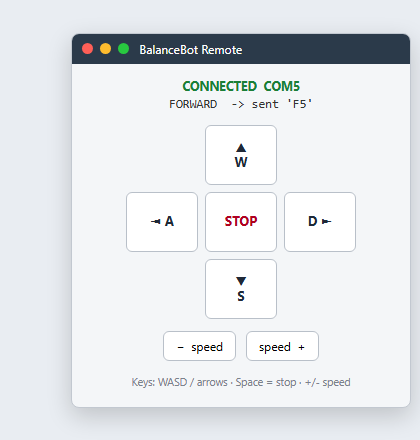

# BalanceBot Remote Controller

A desktop **remote-control app** for my [self-balancing two-wheel robot](https://github.com/ChenSiyun1234/BalanceBot-STM32-CC3200).
It is the **software companion** to the robot's bare-metal STM32 firmware: the firmware
keeps the robot upright and listens on an **HC-05 Bluetooth** module; this app sends the
drive commands.

After the HC-05 is paired, Windows exposes it as a serial **COM port**. The controller
opens that port and streams single-character commands that the firmware parses.

## Screenshot



*Desktop controller (connected state). Drive with WASD / arrows; Space to stop.*

## Features
- **Keyboard + on-screen control** (Tkinter GUI): drive with `WASD` / arrow keys, `Space` to stop.
- **Adjustable speed** (0–9), sent alongside each direction command.
- **Clean command protocol** decoupled from the UI (`BalanceBotLink` class).
- **Simulation mode** — runs and logs commands with no hardware/`pyserial` installed, so the
  logic is testable and the app is demoable offline.
- **Safety stop** on disconnect (sends `S` before closing the port).

## Run
```bash
python balancebot_controller.py              # GUI (simulation if no port given)
python balancebot_controller.py --port COM5  # connect to the paired HC-05 port
python balancebot_controller.py --selftest   # headless test of the command protocol
```
Optional dependency: `pip install pyserial` (for the real Bluetooth/serial link).

## Controls
| Key | Action | Key | Action |
|---|---|---|---|
| `W` / `↑` | forward | `A` / `←` | turn left |
| `S` / `↓` | backward | `D` / `→` | turn right |
| `Space` | stop | `+` / `-` | speed up / down |

## Command protocol
One ASCII character per action, optionally followed by a speed digit `0–9`:

| Command | Byte | Example sent |
|---|---|---|
| forward | `F` | `F5` |
| backward | `B` | `B5` |
| left | `L` | `L5` |
| right | `R` | `R5` |
| stop | `S` | `S` |

This matches the command set the robot's firmware expects over its HC-05 UART link.

---
*Companion to my embedded firmware project. Built to round out the robot with the full
hardware → firmware → control-software stack.*
